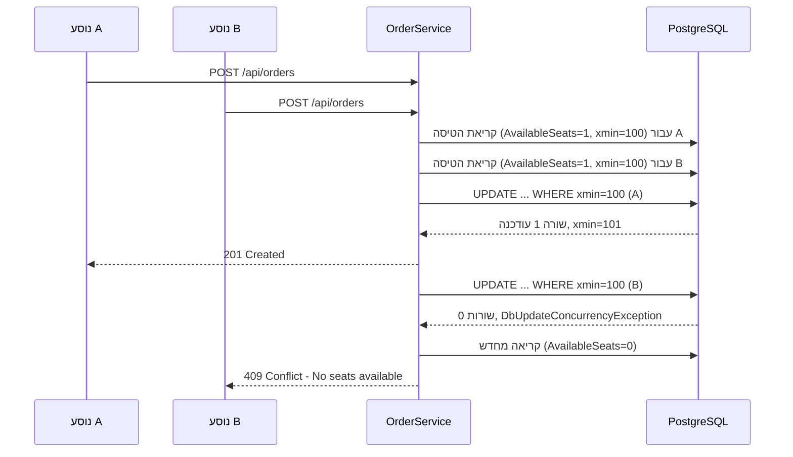
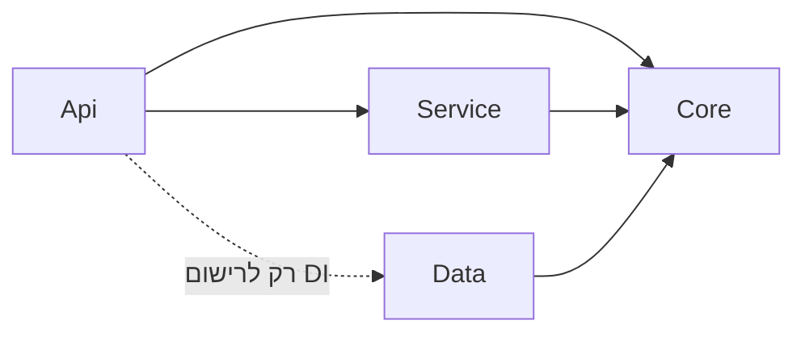
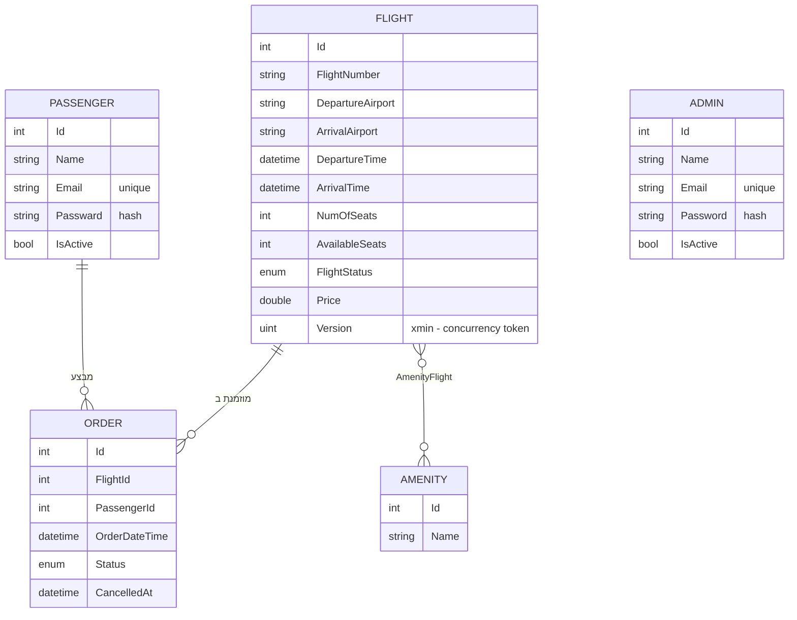

# EL AL SPACE ✦ שרת הזמנת טיסות לחלל

שרת **ASP.NET Core Web API** להזמנת מקומות בטיסות לחלל: לירח, לתחנת המסלול, למאדים ועוד. נוסעים נרשמים, צופים בטיסות הפתוחות, מזמינים מושב ומבטלים הזמנה. מנהלים מנהלים את הטיסות, את השירותים הנלווים, את הנוסעים ואת ההזמנות.

בכל טיסה יש מספר מושבים מוגבל, ויש להם ביקוש. לכן מרכז המערכת הוא **ניהול תחרות על משאב מוגבל**: כמה נוסעים מנסים לתפוס את המושב האחרון באותו רגע, ורק אחד מהם יקבל אותו.

> פרויקט גמר בקורס .NET. הלקוח (React) נמצא ב-repository נפרד.

🌐 **האתר החי:** https://elal-space-client.onrender.com/  
📦 **קוד השרת:** https://github.com/613shu/elalSpaceServer

---

## תוכן עניינים

- [המשאב המוגבל ותחרות בין משתמשים](#המשאב-המוגבל-ותחרות-בין-משתמשים)
- [טכנולוגיות](#טכנולוגיות)
- [ארכיטקטורה](#ארכיטקטורה)
- [מודל הנתונים](#מודל-הנתונים)
- [כללים עסקיים](#כללים-עסקיים)
- [API](#api)
- [טיפול בשגיאות](#טיפול-בשגיאות)
- [לוגים](#לוגים)
- [אבטחה והרשאות](#אבטחה-והרשאות)
- [הרצה מקומית](#הרצה-מקומית)
- [משתמשי דמו ונתוני התחלה](#משתמשי-דמו-ונתוני-התחלה)
- [בדיקות](#בדיקות)
- [החלטות תכנון](#החלטות-תכנון)
- [מבנה הפרויקט](#מבנה-הפרויקט)

---

## המשאב המוגבל ותחרות בין משתמשים

**המשאב:** המושבים הפנויים בטיסה, השדה `Flight.AvailableSeats`.

**הבעיה:** נשאר מושב אחד. שני נוסעים לוחצים "הזמן" באותו רגע. שתי הבקשות קוראות את הטיסה כשעוד נשאר בה מושב, שתיהן עוברות את הבדיקה ושתיהן שומרות. התוצאה: שתי הזמנות מאושרות למושב אחד. במסד אין שום סימן לכך שמשהו השתבש.

**הפתרון: נעילה אופטימית (Optimistic Concurrency)**

1. לישות `Flight` יש **concurrency token**, השדה `Version` (`uint`). ב-`FlightConfiguration` הוא מוגדר כ-`IsRowVersion()`, ו-Npgsql ממפה אותו לעמודת המערכת `xmin` של PostgreSQL, שמתעדכנת אוטומטית בכל שינוי בשורה.
2. כשמזמינים, EF Core מייצר `UPDATE ... WHERE "Id" = @id AND xmin = @originalVersion`. אם מישהו אחר שינה את הטיסה בין הקריאה לשמירה, אף שורה לא מתעדכנת, ו-EF זורק `DbUpdateConcurrencyException`.
3. `OrderService.AddOrder` תופס את החריגה, רושם **Warning** בלוג, מנקה את ה-ChangeTracker וקורא את הטיסה מחדש:
   - **אם נשאר מושב**, הוא מנסה שוב. הנוסע לא מרגיש בכלום.
   - **אם המושבים נגמרו**, הוא מחזיר **‎409 Conflict** עם הודעה ברורה: `No seats available on this flight.`



הבדיקה העסקית והשמירה מתבצעות על אותו אובייקט tracked ובאותה קריאה ל-`SaveChangesAsync`. כך אין "חלון" בין הבדיקה לכתיבה.

כתיבות אחרות לטיסה (עדכון, ביטול) לא מנסות שוב. אם יש בהן התנגשות, ה-middleware הגלובלי ממפה אותה ל-409 ורושם Warning.

---

## טכנולוגיות

| תחום | טכנולוגיה |
|---|---|
| Framework | .NET 8, ASP.NET Core Web API |
| מסד נתונים | PostgreSQL (Npgsql.EntityFrameworkCore.PostgreSQL 8.0.11) |
| ORM | Entity Framework Core 8 (Code-First, Migrations, Fluent API) |
| מיפוי | AutoMapper 16 |
| אימות | JWT Bearer (Microsoft.AspNetCore.Authentication.JwtBearer) |
| גיבוב סיסמאות | PBKDF2-SHA256, 100,000 איטרציות, salt אקראי (`Rfc2898DeriveBytes`) |
| לוגים | NLog (NLog.Web.AspNetCore 6) |
| תיעוד API | Swagger / Swashbuckle, כולל כפתור Authorize ל-JWT |
| בדיקות | xUnit, Moq |

---

## ארכיטקטורה

ארכיטקטורת שכבות, ארבעה פרויקטים ועוד פרויקט בדיקות:

```
ElAlProject.sln
├── ElAlProjectCore      ישויות, Enums, DTOs, ממשקי Repository ו-Service
├── ElAlProjectData      DataContext, Configurations (Fluent API), Repositories, Migrations
├── ElAlProjectService   לוגיקה עסקית, MappingProfile, PasswordHasher
├── ElAlProjectApi       Controllers, Middlewares, Program.cs, nlog.config, DataSeeder
└── ElAlProjectTests     xUnit + Moq
```

**כיוון התלויות:**



- **Core** לא מכיר אף פרויקט אחר ולא תלוי ב-EF Core.
- **Data** ו-**Service** תלויים רק ב-Core ולא זה בזה.
- **Api** לא מזריק `DataContext` או Repository לתוך Controller. הגישה לנתונים עוברת תמיד דרך ממשק Service. את Data הוא מכיר רק כדי לרשום את התלויות ב-`Program.cs`.
- כל השירותים וה-Repositories רשומים כ-**Scoped**, בהתאם ל-`DbContext`, שגם הוא Scoped: מופע אחד לכל בקשה.

**זרימת בקשה:** Controller ← Service (map ← repository ← map) ← Repository ← EF Core ← PostgreSQL. השרשרת כולה async, ו-`CancellationToken` עובר בכל השכבות.

**סדר ה-pipeline ב-`Program.cs`:**

```
CORS → CorrelationId → Global Exception Handling → HTTPS Redirection → Authentication → Authorization → Controllers
```

---

## מודל הנתונים



| קשר | סוג |
|---|---|
| Flight ← Order | אחד-לרבים (FK עם `Restrict`) |
| Passenger ← Order | אחד-לרבים (FK עם `Restrict`) |
| Flight ↔ Amenity | רבים-לרבים, דרך טבלת `AmenityFlight` |

כל הקשרים, האורכים והאינדקסים מוגדרים ב-**Fluent API** (`ElAlProjectData/Configurations`, מחלקת `IEntityTypeConfiguration<T>` לכל ישות). לדוגמה: אינדקס ייחודי על `Email` בנוסעים ובמנהלים, ואורך מקסימלי לכל שדה טקסט.

**מיגרציות:** `mig1` (סכמה ראשונית), `222`, `333` (Fluent API, אורכים, אינדקסים ייחודיים).

---

## כללים עסקיים

**הזמנה**
- רק לטיסה בסטטוס `Scheduled` שעוד לא המריאה.
- רק אם נשאר מושב פנוי. ההזמנה מורידה את `AvailableSeats` באחד.
- לנוסע יכולה להיות רק הזמנה פעילה אחת לכל טיסה.

**ביטול הזמנה**
- מחזיר את המושב לטיסה.
- נוסע יכול לבטל רק את ההזמנה שלו. מנהל יכול לבטל כל הזמנה.
- אי אפשר לבטל אחרי שהטיסה המריאה, ואי אפשר לבטל הזמנה שכבר בוטלה.

**טיסות**
- זמן הנחיתה חייב להיות אחרי זמן ההמראה.
- כל `AmenityIds` שנשלחים חייבים להתקיים.
- ביטול טיסה מבטל גם את כל ההזמנות המאושרות שלה.

**מחיקה רכה:** טיסות והזמנות עוברות לסטטוס `Cancelled`, ונוסעים ומנהלים מסומנים `IsActive = false`. ההיסטוריה נשמרת. שירותים נלווים (Amenity) נמחקים באמת.

כל הבדיקות האלה נמצאות **בשכבת ה-Service** ולא ב-Controller. ה-Controllers דקים: בלי try/catch ובלי לוגיקה.

---

## API

כל הרשימות מדופדפות במסד עצמו (`Skip`/`Take`). ברירת המחדל היא `page=1`, `pageSize=10`, ועמוד מכיל לכל היותר 100 פריטים. המבנה של תשובת רשימה:

```json
{ "items": [ ... ], "totalCount": 42 }
```

### Auth: `/api/auth`
| Method | Route | הרשאה | תיאור |
|---|---|---|---|
| POST | `/api/auth/register` | ציבורי | הרשמת נוסע חדש, מחזיר JWT |
| POST | `/api/auth/login` | ציבורי | התחברות של מנהל או נוסע, מחזיר JWT |

### Flights: `/api/flights`
| Method | Route | הרשאה | תיאור |
|---|---|---|---|
| GET | `/api/flights` | ציבורי | כל הטיסות, ממוינות לפי זמן המראה |
| GET | `/api/flights/available` | ציבורי | רק טיסות פתוחות להזמנה: `Scheduled`, עם מושבים פנויים ושעוד לא המריאו |
| GET | `/api/flights/{id}` | משתמש מחובר | טיסה לפי מזהה |
| POST | `/api/flights` | Admin | יצירת טיסה, מחזיר 201 עם Location |
| PUT | `/api/flights/{id}` | Admin | עדכון טיסה |
| DELETE | `/api/flights/{id}` | Admin | ביטול טיסה וכל הזמנותיה, מחזיר 204 |

### Orders: `/api/orders`
| Method | Route | הרשאה | תיאור |
|---|---|---|---|
| POST | `/api/orders` | Passenger | הזמנת מושב. **כאן מתרחשת התחרות על המשאב**. מחזיר 201, או 409 אם המושב נתפס |
| GET | `/api/orders/my` | Passenger | ההזמנות שלי |
| GET | `/api/orders` | Admin | כל ההזמנות |
| GET | `/api/orders/{id}` | Admin, Passenger | הזמנה לפי מזהה. נוסע רואה רק את שלו (אחרת 403) |
| DELETE | `/api/orders/{id}` | Admin, Passenger | ביטול הזמנה, מחזיר 204 |

### Amenities: `/api/amenities`
| Method | Route | הרשאה |
|---|---|---|
| GET | `/api/amenities`, `/api/amenities/{id}` | ציבורי |
| POST / PUT / DELETE | `/api/amenities[/{id}]` | Admin |

### Passengers: `/api/passengers`
| Method | Route | הרשאה | תיאור |
|---|---|---|---|
| GET | `/api/passengers/me` | Passenger | הפרופיל של הנוסע המחובר |
| GET | `/api/passengers`, `/api/passengers/{id}` | Admin | רשימת נוסעים ונוסע בודד |
| DELETE | `/api/passengers/{id}` | Admin | מחיקה רכה |

### Admins: `/api/admins`
| Method | Route | הרשאה |
|---|---|---|
| GET | רשימה ופריט בודד | Admin |
| DELETE | `/{id}` (מחיקה רכה) | Admin |

התיעוד המלא זמין ב-Swagger בזמן ריצה, בכתובת `/swagger`.

---

## טיפול בשגיאות

`ExceptionHandlingMiddleware` הוא המקום **היחיד** שמתרגם חריגות לתשובות HTTP. כל שגיאה חוזרת באותו מבנה JSON:

```json
{
  "statusCode": 409,
  "message": "No seats available on this flight.",
  "correlationId": "3f2a9c1e-..."
}
```

| חריגה | סטטוס | רמת לוג | מתי |
|---|---|---|---|
| `DbUpdateConcurrencyException` | 409 | Warning | התנגשות על concurrency token |
| `InvalidOperationException` | 409 | Warning | הפרת כלל עסקי מול מצב הנתונים, למשל "אין מושבים" או "כבר הזמנת" |
| `ArgumentException` | 400 | Warning | קלט לא תקין שהתגלה ב-Service, למשל נחיתה לפני המראה |
| `KeyNotFoundException` | 404 | Warning | ישות לא נמצאה |
| `UnauthorizedAccessException` | 403 | Warning | ניסיון לגשת למשאב של משתמש אחר |
| כל חריגה אחרת | 500 | **Error** | תקלה לא צפויה. ה-stack trace נרשם בלוג ולא נשלח ללקוח |

**ולידציה:** ל-Request DTOs יש Data Annotations (`[Required]`, `[Range]`, `[StringLength]`, `[EmailAddress]`, `[MinLength]`). בזכות `[ApiController]`, קלט לא תקין מקבל 400 אוטומטית, עוד לפני שהבקשה מגיעה ל-Service. האורכים ב-DTOs תואמים לאורכים שמוגדרים ב-Fluent API.

ה-middleware **לא** קורא ל-`Response.Clear()`. כך נשמרות כותרות ה-CORS גם בתשובות שגיאה, והלקוח מקבל את השגיאה האמיתית ולא "CORS error".

---

## לוגים

**NLog** מחובר מתחת ל-`ILogger` הסטנדרטי. הקוד עצמו לא מכיר את NLog, כך שאפשר להחליף ספריית לוגים בלי לגעת בשכבות הפנימיות.

- **CorrelationId:** `CorrelationIdMiddleware` יוצר מזהה לכל בקשה, או משתמש במזהה שהגיע בכותרת `X-Correlation-Id`. הוא מחזיר את המזהה בכותרת התשובה ומכניס אותו ל-logging scope, כך שכל שורת לוג באותה בקשה, מכל שכבה, נושאת אותו מזהה.
- **כל בקשה נכנסת** נרשמת ברמת Information: `Incoming request {Method} {Path}`.
- **כל התנגשות על משאב** נרשמת ברמת Warning, עם מזהה הטיסה והנוסע.
- **כל חריגה** נרשמת. חריגות צפויות ברמת Warning, ותקלות ברמת Error עם stack trace מלא.
- **לא נרשמים** סיסמאות, טוקנים או תוכן בקשות הרשמה.

| יעד | קובץ | רמות |
|---|---|---|
| קובץ כללי | `logs/app-{date}.log` | Debug ומעלה |
| קובץ שגיאות | `logs/errors-{date}.log` | Warning ומעלה |
| קונסול | stdout | Debug ומעלה |

מבנה שורה:
```
2026-10-08 21:14:03.1234|WARN|CorrelationId=3f2a9c1e-...|ElAlProjectService.Services.OrderService|Seat conflict on flight 26 for passenger 4. Retrying with fresh data.
```

---

## אבטחה והרשאות

- **JWT:** הטוקן חתום ב-HMAC-SHA256 ותקף 60 דקות. השרת מאמת issuer, audience, תוקף וחתימה. ה-claims: `NameIdentifier`, `Name`, `Email`, `Role`.
- **שני תפקידים עם הרשאות שונות באמת:**
  - **Admin:** ניהול טיסות ושירותים, צפייה בכל הנוסעים וההזמנות, ביטול כל הזמנה.
  - **Passenger:** צפייה בפרופיל שלו, הזמנה, וצפייה בהזמנות שלו וביטולן בלבד.
- **ההרשאות נאכפות בשרת** באמצעות `[Authorize(Roles = ...)]`. הבעלות על הזמנה נבדקת ב-Service ומחזירה 403.
- **סיסמאות:** נשמרות רק כ-hash של PBKDF2 עם salt ייחודי לכל משתמש. ההשוואה נעשית ב-`CryptographicOperations.FixedTimeEquals`.
- **סודות:** מחרוזת החיבור ומפתח ה-JWT לא נמצאים בקוד ולא ב-repository. בפיתוח הם נשמרים ב-**User Secrets**.

---

## הרצה מקומית

### דרישות מקדימות
- [.NET 8 SDK](https://dotnet.microsoft.com/download/dotnet/8.0)
- **PostgreSQL** 14 ומעלה, מקומי או מרוחק (למשל Neon). צריך משתמש עם הרשאה ליצור מסדי נתונים.

### 1. שכפול
```bash
git clone https://github.com/613shu/elalSpaceServer.git
cd elalSpaceServer
```

### 2. הגדרת סודות (User Secrets)
```bash
cd ElAlProjectApi
dotnet user-secrets set "ConnectionStrings:Default" "Host=localhost;Port=5432;Database=ElAlSpaceDb;Username=postgres;Password=<your-password>"
dotnet user-secrets set "Jwt:Key" "<מחרוזת אקראית באורך 32 תווים לפחות>"
# אופציונלי: רישיון AutoMapper (בלעדיו תופיע אזהרה בלבד)
dotnet user-secrets set "AutoMapper:LicenseKey" "<license-key>"
```

### 3. הרצה
```bash
dotnet run --project ElAlProjectApi --launch-profile http
```

**בעלייה, השרת מריץ אוטומטית את כל המיגרציות** (`Database.MigrateAsync`) **וממלא נתוני התחלה** (`DataSeeder`). אין צורך להריץ `dotnet ef database update` ידנית.

- Swagger: http://localhost:5254/swagger
- בפרופיל `https`: https://localhost:7000/swagger

### 4. חיבור הלקוח
מקורות ה-CORS המורשים מוגדרים ב-`appsettings.Development.json`:
```json
"Cors": { "Origins": [ "http://localhost:3000", "http://localhost:5173" ] }
```

### יצירת מיגרציה חדשה (למפתחים)
```bash
dotnet ef migrations add <Name> -p ElAlProjectData -s ElAlProjectApi
```

---

## משתמשי דמו ונתוני התחלה

| תפקיד | אימייל | סיסמה |
|---|---|---|
| Admin | `admin@gmail.com` | `111222` |
| Passenger | `passenger@gmail.com` | `111222` |

אפשר גם לרשום נוסעים נוספים דרך `POST /api/auth/register` או במסך ההרשמה באתר.

**נתוני ההתחלה (`DataSeeder`)** נוצרים רק כשהם עוד לא קיימים במסד:
- 6 שירותים נלווים, למשל חלון פרטי, כבידה מדומה וארוחות שף.
- 25 טיסות מתל אביב ליעדים הירח, תחנת המסלול, מאדים, אירופה ושבתאי. ההמראות פרוסות על פני השבועות הבאים.
- 5 טיסות **מקרי קצה**, שנועדו להדגים את הכללים העסקיים:

| טיסה | מצב | מה היא מדגימה |
|---|---|---|
| `ES 901` | מושב **אחד** פנוי | תחרות על המושב האחרון (409) |
| `ES 902` | 0 מושבים | הזמנה נדחית |
| `ES 903` | `Cancelled` | טיסה מבוטלת לא פתוחה להזמנה |
| `ES 904` | המריאה אתמול | אי אפשר להזמין או לבטל אחרי המראה |
| `ES 905` | `Completed` | טיסה שהסתיימה |

**הדגמת התחרות:** מתחברים כשני נוסעים שונים (נוסע הדמו ונוסע שנרשם), בשני דפדפנים, ושולחים `POST /api/orders` ל-`ES 901` כמעט יחד. אחד מקבל 201 והשני 409.

---

## בדיקות

```bash
dotnet test
```

**19 בדיקות, כולן עוברות:** 18 בדיקות יחידה ובדיקת אינטגרציה אחת.

### `Services/OrderServiceTests`: xUnit + Moq (18 בדיקות)
בדיקות יחידה לשכבת ה-Service. ה-Repositories מוחלפים ב-Mock, ולכן לא נדרש מסד נתונים. הבדיקות מכסות את הלוגיקה של המשאב המוגבל **גם במקרה ההצלחה וגם במקרה הדחייה**:

- הזמנה כשיש מושב: נשמרת ומורידה מושב.
- הזמנה כשאין מושבים: נדחית ולא נשמרת.
- **התנגשות שאחריה נשאר מושב: ניסיון חוזר מצליח.**
- **התנגשות על המושב האחרון: נדחית.**
- טיסה לא קיימת, מבוטלת, שהסתיימה או שכבר המריאה. הזמנה כפולה.
- צפייה וביטול לפי בעלות: הבעלים, נוסע אחר ומנהל. ביטול כפול.

### `Concurrency/FlightConcurrencyTests`: בדיקת אינטגרציה מול PostgreSQL
מוכיחה שה-concurrency token עובד במסד אמיתי:
1. יוצרת מסד בדיקות נפרד (`ElAlTestDb`), מריצה עליו את כל המיגרציות ויוצרת טיסה עם מושב אחד.
2. שני `DataContext` נפרדים קוראים את אותה טיסה, ושניהם מורידים מושב.
3. השמירה הראשונה מצליחה, והשנייה זורקת `DbUpdateConcurrencyException`.
4. במסד נשאר `AvailableSeats = 0`.

הבדיקה קוראת את מחרוזת החיבור מה-User Secrets של `ElAlProjectApi`, ובסיום מוחקת את מסד הבדיקות.

---

## החלטות תכנון

| החלטה | הנימוק |
|---|---|
| **מונה מושבים** (`AvailableSeats`) ולא ישות `Seat` לכל מושב | המערכת לא מציעה בחירת מושב ספציפי, אז מונה מספיק. ישות `Seat` הייתה מוסיפה טבלה וקשרים בלי ערך עסקי. לכל טיסה יש token אחד, וההתנגשות נתפסת במקום אחד |
| **נעילה אופטימית** ולא פסימית | ביישום web, רוב הבקשות לא מתנגשות. הנעילה האופטימית לא מחזיקה נעילות במסד, לא גורמת להמתנה או ל-deadlocks, ומזהה התנגשות רק כשהיא באמת קורית |
| **`xmin`** של PostgreSQL כ-token | עמודת מערכת שמתעדכנת אוטומטית בכל שינוי בשורה. אין צורך לנהל גרסה ידנית או לדרוס את `SaveChangesAsync` |
| **ניסיון חוזר** אחרי התנגשות | התנגשות לא תמיד אומרת שהמושב נגמר. אם בטיסה של 24 מקומות שני נוסעים הזמינו יחד, שניהם צריכים לקבל מקום. 409 חוזר רק כשהמושבים באמת אזלו |
| **PostgreSQL** | מסד חינמי וזמין גם בענן (Neon), כך שהשרת רץ מכל מחשב בלי התקנה מקומית. כל התאריכים נשמרים ב-UTC |
| **מחיקה רכה** | הזמנה שבוטלה היא היסטוריה עסקית. מחיקה אמיתית הייתה מוחקת גם את התיעוד ושוברת מפתחות זרים |
| **DTOs נפרדים לפי קהל** (`AdminResponse_*` / `PassengerResponse_*`) | נוסע לא מקבל מידע שמיועד למנהל, למשל רשימות נוסעים. ישויות Core לא נחשפות ב-API |
| **קריאות `AsNoTracking`**, ו-tracking רק ב-`GetXForUpdate` | שאילתות קריאה לא משלמות על מעקב שינויים. רק מה שעומד להשתנות נטען עם tracking |
| **`Include`/`ThenInclude`** בכל שאילתה שמחזירה קשרים | אין N+1: כל רשימה נטענת בשאילתה אחת |
| **מיגרציות ונתוני התחלה בעלייה** | השרת עולה מוכן לשימוש בלי שום פעולה ידנית במסד |

---

## מבנה הפרויקט

```
ElAlProjectCore/
├── Models/            Flight, Order, Passenger, Admin, Amenity, LoginModel
├── Enums/             FlightStatus, OrderStatus
├── DTOs/              RequstDTOs (Admin/Passenger/Auth), ResponseDTOs (Admin/Passenger/Auth)
├── Repositories/      I*Repository
└── Services/          I*Service

ElAlProjectData/
├── DataContext.cs
├── Configurations/    *Configuration.cs (Fluent API)
├── Repositories/      *Repository.cs
├── Extensions/        QueryableExtensions.ToPagedAsync
└── Migrations/

ElAlProjectService/
├── Services/          Flight, Order, Amenity, Passenger, Admin, Auth
├── Mapping/           MappingProfile (AutoMapper)
└── Security/          PasswordHasher

ElAlProjectApi/
├── Controllers/       Flights, Orders, Amenities, Passengers, Admins, Auth
├── Midldlewares/      CorrelationIdMiddleware, ExceptionHandlingMiddleware
├── Helpers/           AuthHelper (JWT), DataSeeder
├── Program.cs
├── nlog.config
└── appsettings*.json

ElAlProjectTests/
├── Services/          OrderServiceTests
└── Concurrency/       FlightConcurrencyTests
```

